# Add to Cart Task Using Router - React

- An Add to Cart ReactJS application that fetches product data from the Fake Store API and allows users to add products to the cart through a router interface.

## Table of Contents:

- Overview
- Introduction
- Features
- Installation
- Design
- Code-structure

## Overview:

- The application consists of two main pages: the product page and the cart page. The product page displays a list of products fetched from the Fake Store API, and allows users to add products to their cart. The cart page displays the cart contents, and allows users to remove products from their cart.

## Introduction:

- This project is a simple e-commerce application that allows users to add products to their cart and view their cart contents. The application uses ReactJS, React Router, and Tailwind CSS for styling.

## Features:

- Displays a list of products fetched from the Fake Store API
- Allows users to add products to their cart
- Displays the cart contents and allows users to remove products from their cart
- Calculates the subtotal and applies a 10% discount to the total price
- Uses React Router to navigate between the product page and the cart page

## Technologies Used:

- ReactJS: A JavaScript library for building user interfaces
- React Router: A library for managing client-side routing in React applications
- CSS for styling

## Design

- The application is designed to responsive and works well on both desktop and mobile devices. The products are displayed in a grid layout, with each product displaying key information such as the product image, title, price, and add to cart button.
- `Navbar` is available in top page of application, which contains `Home & Cart` page button.
- Position Stikcy option is applied to Navbar for scrolling interface.
- `Router` technique used to navigate to a `Cart & Home` page
- Product details are displayed in card format below the Navbar in Home Page.
- `Add to Cart` button is provided for each card.
- Once `Add to Cart` button is clicked, the product to be added to the Cart count detail is displayed in Cart button avilable in Navbar.
- Once `Add to Cart` button is clicked, `increase, decrease and remove button along with quantity` will be displayed in place of `Add to Cart` button in the card.
- Product details of already added to cart is displayed in `Cart` page in the card format along with `increase, decrease, remove button, quantity and cost considering quantity`.
- Final price considering each product, cost, quantity and discount is displayed top of `Cart` page.
- `Total price, Discount, and Final price` details are displayed below all the card.

## Project Structure:

The project consists of the following components:

- App.jsx: The main application component that renders the product page and the cart page
- Navbar.jsx: The navigation bar component that displays the cart count and allows users to navigate between the product page and the cart page
- Products.jsx: The product page component that displays the list of products and allows users to add products to their cart
- Cart.jsx: The cart page component that displays the cart contents and allows users to remove products from their cart
- Index.css: Which contains a complete styling code of this task.

## API:

The application uses the Fake Store API to fetch the list of products. The API endpoint is https://fakestoreapi.com/products.

## Installation:

- Open the URL - `https://add-to-cart-using-react-router.netlify.app/` in your browser to load the application.

## How to use / Demo:

- Overview of Home Page - User can see the list of product that fetched from `fakestoreapi`
  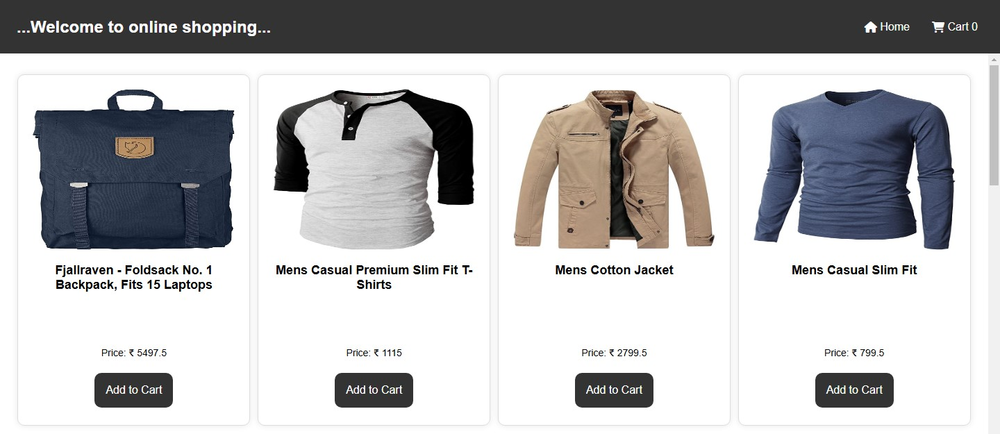
  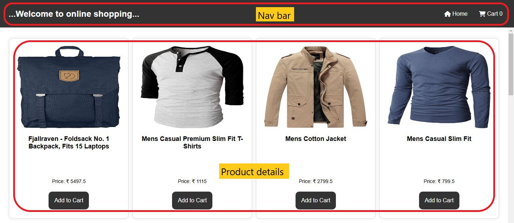
  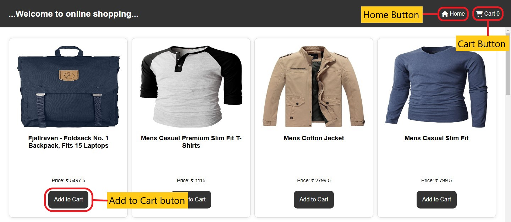

- Click `Add to Cart` button to add a specific product to the cart
  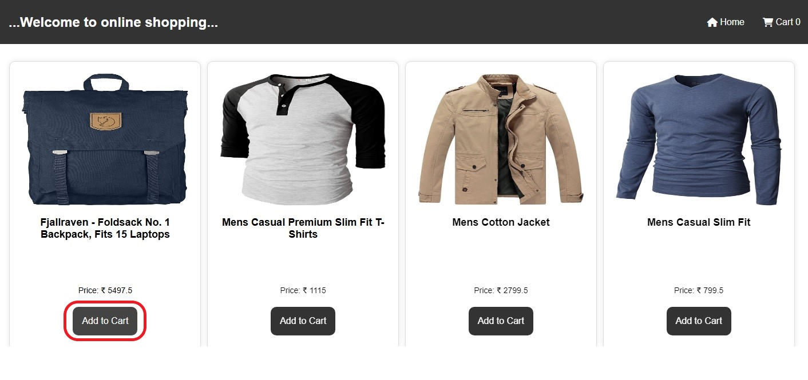

- Once clicked the `Add to Cart` button, Cart count will be updated.
  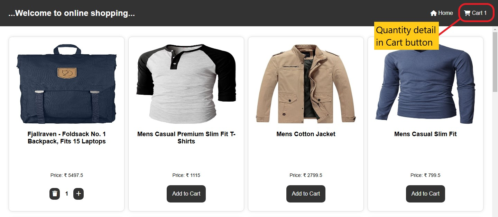

- Once clicked the `Add to Cart` button, Remove / Increase / Decrease button and quantity details are displayed in place of `Add to Cart` button.

  - UI @ Part quantity is 1
    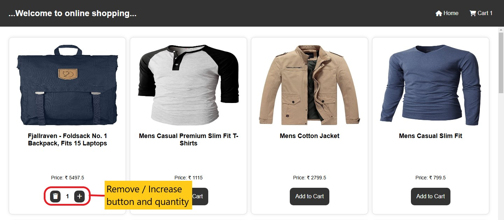

  - UI @ Part quantity is more than 1
    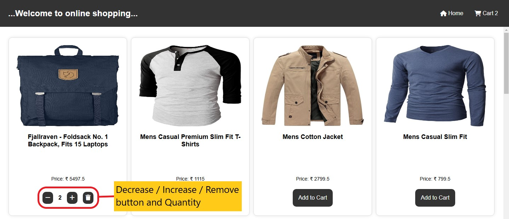

- Overview of Cart Page - User can see the list of product that already added to cart
  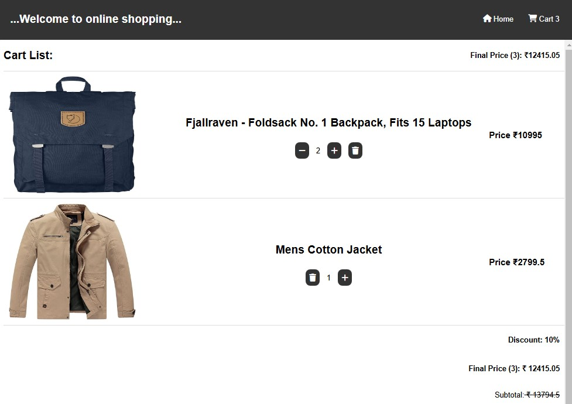
  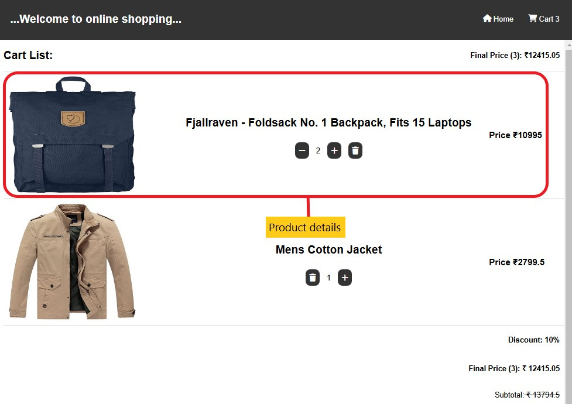
  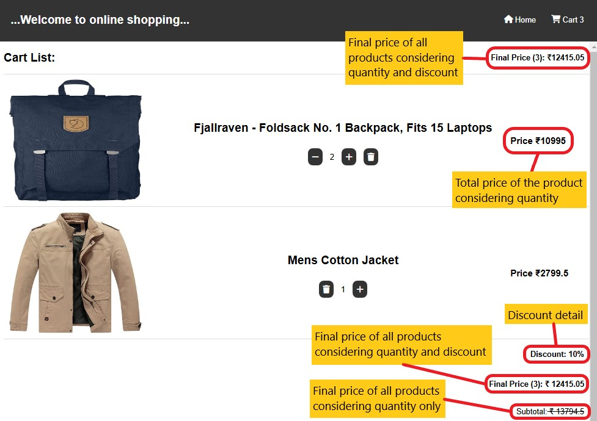

  - Buttons for Part quantity 1
    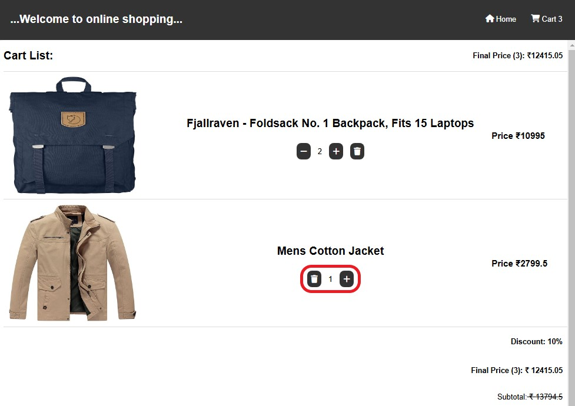
  - Buttons for more than 1 Part quantity
    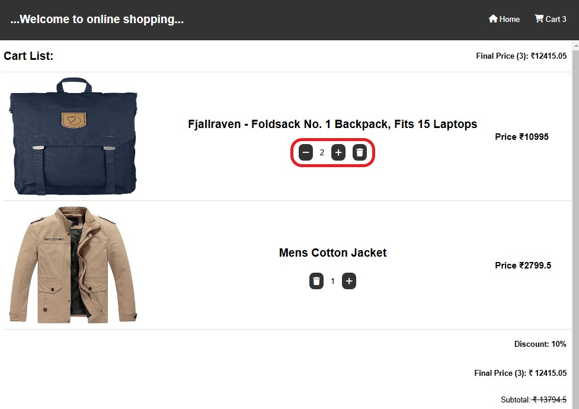
